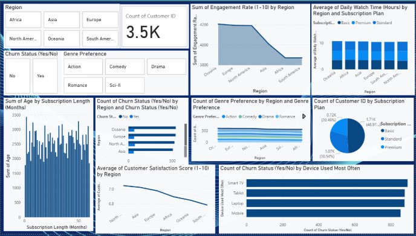
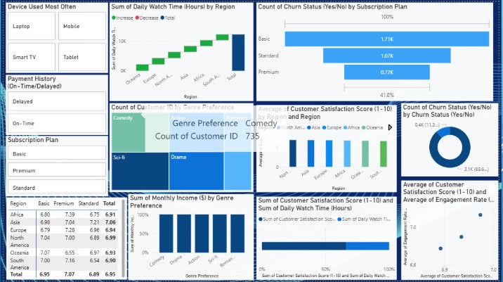

# Introduction
This project explores the capabilities of Power BI in visualizing and analyzing user engagement data from Netflix.
The aim is to derive meaningful insights from the dataset through interactive dashboards, aiding content performance evaluation and user behavior analysis.
As data consumption in the entertainment industry grows, leveraging BI tools for strategic content planning is crucial.

# Proposed Methodology
1.Collection cleaning of Netflix engagement dataset.
2.Importing the dataset into Power BI.
3.Creating data models and relationships.
4.Building dashboards with charts, slicers, cards.
5.Analysis and interpretation of visualizations.
6.Documentation and final report preparation.

# Expected outcome of the proposed work
~ A Power BI report/dashboard providing deep insights into Netflix user engagement.
~ Visual identification of top-performing content and watch time trends.
~ Enhanced understanding of viewer behaviour segmented by genre, country, and duration.
~ Practical demonstration of Power BI as a storytelling and analytics tool in the streaming domain.

Preview
 

Dashboard 1 

Dashboard 2 

In order to use this download Power BI and open the Parivesh Netflix.pbix and there you can see the excel sheet along with the dashboard 

Meanwhie in the pdf , it is summarized on what all work i have done
